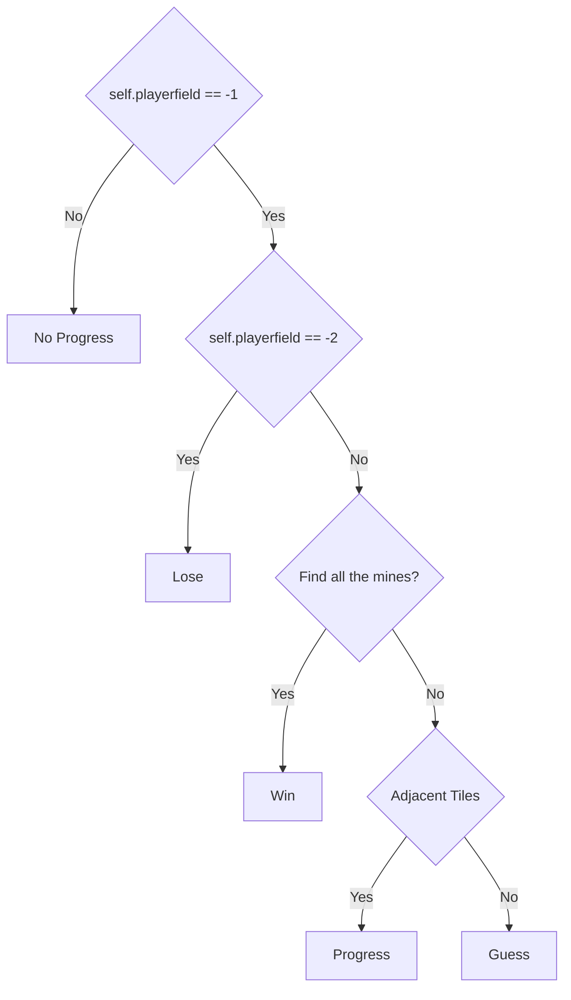

# 24-1-MineMasters-01
[ 24-1 /  MineMasters / Team 01 ]  
👩‍💻 주민서, 김도희

**train: 최고 승률 65%**

**test: 평균 승률 56%**

## Environment

---

👑 `self.reward` : 게임 진행 상황에 따른 보상을 저장하는 딕셔너리 어트리뷰트 

- `lose` :  -1
- `progress` : 0.3
- `no_progress` : -1
- `guess` : 0.1
- `win` : 1

🧨 `self.minefield` : 지뢰찾기 게임의 지뢰 배치 정보를 저장하고 있는 어트리뷰트로 정답지의 역할 

무작위로 지뢰를 배치한 후 지뢰 주변 타일의 숫자를 하나씩 증가시키며 계산한다.

- type : np.array
- 구조 : (height, width) = ( 9 , 9 )
    - 지뢰 :  -2
    - 지뢰 주변 타일 : 1 이상 8 이하
    - 그 외 타일 : 0

- `self.minefield` 어트리뷰트는 `initialize_minefield()` 메서드로 생성
- `self.playerfield` : 플레이어가 볼 수 있는 게임 판 정보를 저장하고 있는 어트리뷰트
    - type : np.array
    - 구조 : (height, width) = ( 9 , 9 )
        - 숨겨진 타일 : -1
        - 공개된 타일 : -2 (지뢰) 또는 0 이상 (지뢰 주변 타일)
- `self.exploded` : 지뢰가 터졌는지 여부를 나타냄
- `self.done` : 게임이 끝났는지 여부를 나타냄
    
    (지뢰를 제외하고 나머지 타일을 모두 열어 확인한 경우(이김) or `self.exploded` == `True` )
    
- 초기화 시, `self.playerfield`에서 1개이상의 타일이 공개된 상태로 **정규화** 후 반환

보상의 scale을 크게 하는 것보다 작게 하는게, 안정적으로 학습 

주어진 x, y 위치의 타일을 `self.minefield` 에서 가져와 `self.playerfield`에 반영하고 반환

`self.playerfield[x, y]` == 0인 경우에 사용하는 메서드

시작 타일인 (x,y) 를 큐에 추가하고 큐가 비지 않을 때까지 큐에서 첫번째 요소를 꺼내 cx, cy로 반환

- 현재 위치 `(cx, cy)`의 인접한 모든 칸을 탐색
- `self.playerfield`에서 숨겨진 타일(-1)인 경우에만 처리
- 숨겨진 타일이면 ****`self._uncover(i, j)`로 해당 타일을 연다.
- 해당 타일이 빈 타일(0)일 경우, 큐에 추가

정규화 후 반환하는 메서드

🌟 정규화는 안정적인 학습을 위해서 매우 중요하다.

정규화를 하지 않은 결과, score가 음으로 발산하고 학습 속도가 느려졌음

`self.playerfield`를 기반으로 현재 사용자 필드를 문자열로 만들어 출력하는 메서드

- `self.playerfield[x, y] == 9` : ‘ . ’으로 숨겨진 타일을 표현
- `self.playerfield[x, y] == -1` : ‘M’으로 지뢰를 표현
- `이외의 경우` : 1~8의 숫자로 주변 지뢰의 개수를 표현

## Net

---

### DQN

👉 기존의 Q-learning은 각 상태 s에 따른 행동 a에 대한 보상의 기댓값인 Q(s, a)을 테이블 형식으로 저장하여 현재 상태에 대해 가장 높은 q-value를 가지는 행동을 선택했다. 

🚨 그러나 테이블 기반은 다음과 같은 제약을 가진다. 

- agent가 취할 수 있는 행동의 수가 많아질 때 테이블이 제대로 구축되기 어렵다.
- 순차적인 sample data의 correlation으로 인해 잘못된 방향으로 학습될 수 있다.
- 정답 q-value가 계속 변해 학습이 불안정하다.

💡 DQN은 인공신경망을 사용해 상태 s가 입력으로 주어지면 행동별 q-value를 출력한다. 

💭 DQN의 특징

- 신경망을 사용해 행동별 q-value를 근사하기 때문에 행동 수가 많아져도 괜찮다.
- replay memory를 사용하여 sample data 사이에 correlation을 제거하고 queue 구조로 시간이 지날수록 질 좋은 memory로 채워진다.
- 학습신경망과 타깃신경망을 분리한다. 일정 시간 동안 타깃신경망을 고정해놓기 때문에 정답이 계속 변한다는 불안정성이 완화된다. 일정 시간 이후에는 타깃신경망을 학습신경망으로 업데이트한다.

🌟 CNN을 이용하여 지뢰찾기 판에서 각 픽셀 주변의 특징을 잡아낼 수 있다. → 입력으로 들어오는 state를 (9, 9)의 이미지로 설정한다. 

### CNN —version 1

👩‍💻 코드 설명

- 매 층마다 (3, 3) 크기의 64개 필터를 사용한다.
- 입력의 크기 변화: (1, 1, 9, 9) → (1, 64, 11, 11) → (1, 64, 11, 11) → (1, 64, 11, 11) → (1, 64, 11, 11) → (1, 1, 64*11*11) → (1, 1, output)
- output을 `NeuralNet`의 인자로 받아 다르게 설정할 수 있도록 했다.

### CNN —version 2

👩‍💻 코드 설명

- 기본적인 구조는 CNN —version 1과 같다. 다만 이미지의 사이즈를 계속 (9, 9)로 고정시켰다.
- `batch normalization`을 통해 평균을 0, 표준 편차를 1로 설정하여 학습을 안정화시켰다.
- `dropout`을 통해 과적합을 방지했다.
- 2개의 `fully connected layer`를 사용했다. → `fully connected layer`가 전체적인 구조를 더 파악해줄 수 있다는 아이디어

## Agent

---

### Hyperparameter

💡 `hyperparameter` 조정을 통해 얻은 인사이트

- 메모리 사이즈가 어느 정도 커야 agent가 양질의 메모리가 쌓인 상태로 학습 가능하다.
- 엡실론이 너무 빨리 decay되면 agent가 충분히 탐험할 수 없으므로, 엡실론을 크게 하고 decay 속도를 늦춰야 한다.
- episode가 매우 많으므로 GPU를 이용하여 학습 속도를 증가시켰다.
- `learning rate`를 작게 하여 agent를 안정적으로 학습시킬 수 있다.

### Agent

👉 learning rate scheduler로 CyclicLR을 사용했다. learning rate가 계속 감소하는 것보다 증감을 반복하는 것이 agent의 탐험에 좋을 것이라 예상했다.  

👉 get_action

🚨 문제

- 같은 타일을 계속 선택한다.
- 이미 열린 타일을 선택한다.

 💭 기존의 해결책

- `random`: `random_list`를 만들어서 닫힌 타일을 선택할 때까지 계속 행동을 고른다.
- `max q-value`: `max q-value`를 가지는 타일(행동)이 이미 열려 있다면 그 값을 `min q-value`로 설정하고 다음으로 큰 q-value를 고른다.

🧐 기존의 해결책으로도 같은 타일을 계속 누르거나 이미 열린 타일을 누르는 문제를 해결할 수 있었지만, 이것이 agent의 학습에 혼란을 주었다고 생각한다. 

💡 억지로 행동을 바꾸는 것보다, reward를 설정하여 agent로 하여금 반복 행동이 좋지 않다는 것을 알려주는 것이 강화학습의 취지에 적합하다고 생각 → `get_action` 부분의 코드를 아래와 같은 일반적인 코드로 수정했다. `unsqueeze(0)`을 두 번 적용해 state가 net에 들어갈 때의 차원을 맞춰줬다. 

👉 `train_model`

📚 replay memory

- states와 next_states는 CNN의 입력으로 주어져야 한다 → `unsqueeze(1)`을 적용해 (batch_size, 1, 9, 9)로 차원을 맞춰준다.
- rewards, explodeds, dones: 벨만 최적 방정식 계산 부분에서 차원을 맞춰주기 위해 reshape(-1, 1)을 적용했다.
- 최종적으로 차원을 정리하면 다음과 같다.
    - states: (batch_size, 1, 9, 9)
    - actions: (batch_size, 1)
    - next_states: (batch_size, 1, 9, 9)
    - rewards: (batch_size, 1)
    - explodeds: (batch_size, 1)
    - dones: (batch_size, 1)

✏️ 인공신경망 업데이트

## Main

---

### Train

→ EPISODES = 10만번

✅ 활용한 지표

- `score`: 100번째 epsiode마다 score의 중간값 출력
- `epsilon`: 100번째 episode마다 엡실론 출력
- `win_rate`: 100번째 episode마다 승률 출력
- `loss_avg`: 학습신경망이 타깃신경망에 수렴하고 있는지 확인하기 위한 지표로 100번째 episode마다 loss 평균 출력
- `action_avg`: 100번째 episode마다 행동 개수의 평균 출력

### Visualization

- score

- win rate

- loss average

- action average

## Test

---

Test 시에는 epsilon 이 0.0이라는 점에 유의

→ 최대의 q-value를 가지는 행동을 계속 선택한다는 점에서 무한 에피소드 진행

- 해결방안
    1. 같은 행동을 특정 횟수이상 반복시, 다음으로 q-value 값이 큰 action을 선택 
        
        :  강화학습에서 행동을 선택하는 방식과 맞지 않아 채택하지 않음
        
    2. 같은 행동을 선택시, 패배로 간주 
        
        : `test_action_epi` 리스트에 행동들을 저장하여, epsilon이 0.0일 때 발생하는 문제를 해결
        

`test_model` 이라는 함수를 만들어, train에서의 지표들을 100번마다 출력하고 10000번의 에피소드 진행 후에는 100번 마다 `win_rate`의 평균과 표준편차를 구함

### Test Result

- Standard Deviation을 구할 때, 승패여부를 저장한 `win_list` 에 대해서 구하면 0과 1 뿐이라는 점에서 0.49 정도로 매우 크게 나오는데 승률에 대한 Standard Deviation으로는 적절하지 않다고 생각. 그래서 100번의 에피소드마다 나온 승률의 Standard Deviation으로 구함
